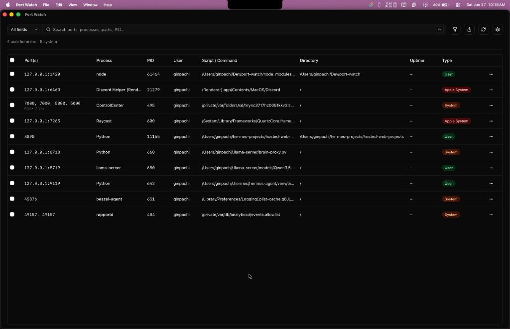
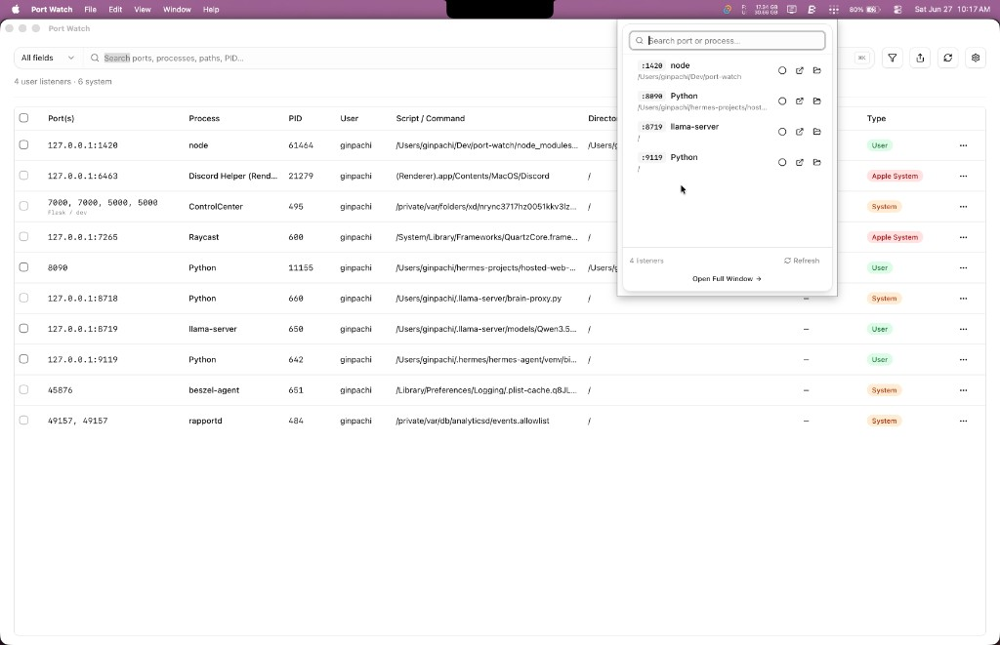
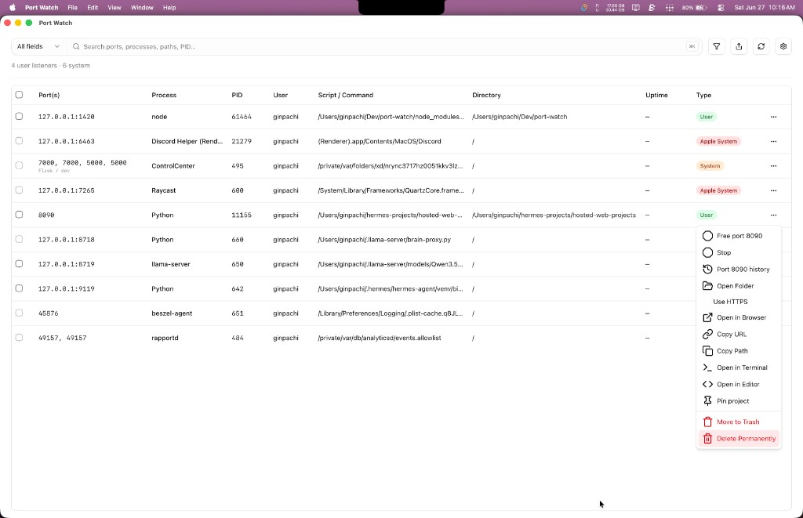
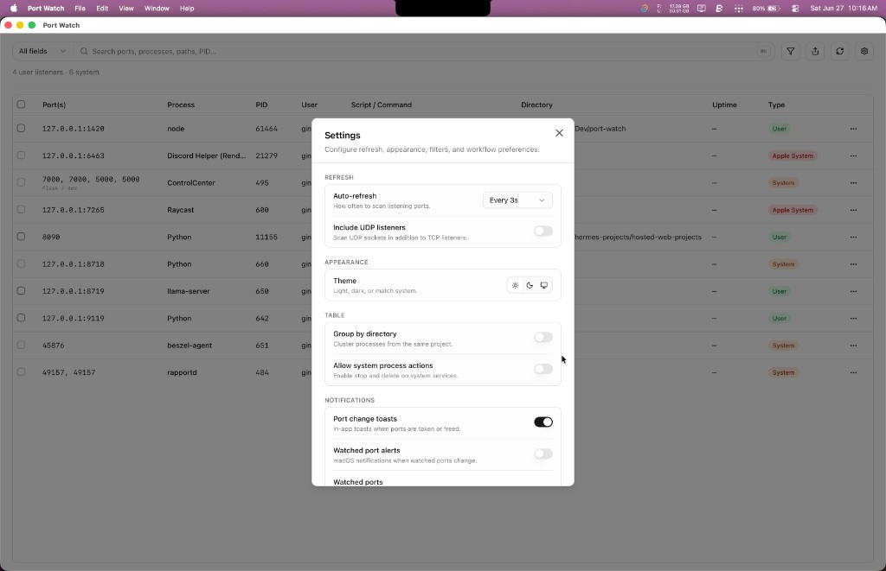
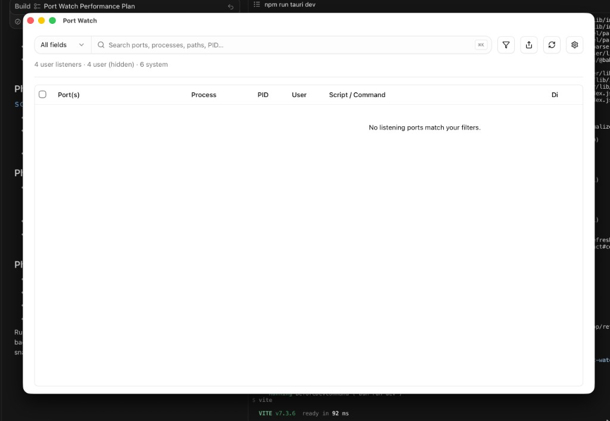
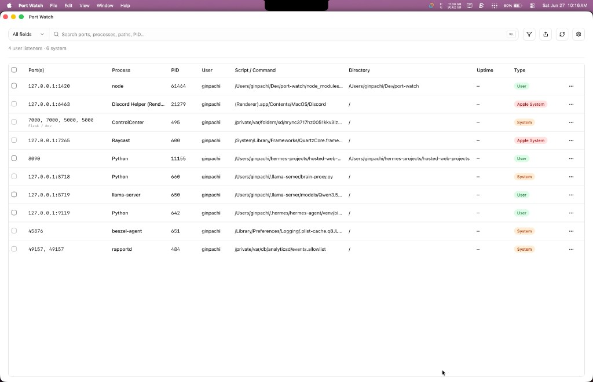
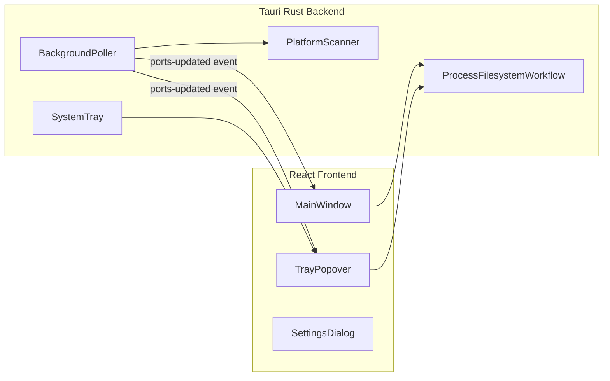

# Port Watch

<p align="left">
  
</p>

Cross-platform desktop port monitor built with **Tauri 2**, **React**, and **shadcn/ui**. Scan listening TCP/UDP ports, classify processes, and manage dev servers from the system tray or full window.



## Screenshots

| Main window (dark) | Tray popover |
| --- | --- |
|  |  |

| Row actions | Settings |
| --- | --- |
|  |  |

| Port search | Main window (light) |
| --- | --- |
|  |  |

## Features

- **Live port scan** with configurable auto-refresh (3s / 10s / off), optional UDP
- **Process classification** — vendor/system/user listeners (Apple, Microsoft, distro packages), with filters to hide system services
- **Port lookup** — search by port, PID, process name, path, or command; history timeline and one-click **Free port**
- **Row actions** — stop process, open in browser, file manager, terminal, editor (Cursor / VS Code), copy path/URL, pin project, move to trash, delete permanently
- **Compact tray popover** for quick access without opening the full window
- **Watched-port notifications** — in-app toasts and desktop alerts when specific ports change
- **Export snapshot** — copy filtered results as JSON or Markdown
- **CLI** — `port-watch check <port> [--udp]` for scripting and CI
- **Safety guards** — blocks destructive actions on protected system paths

## Platform support

| Platform | Scanner backend | CLI PATH install |
| --- | --- | --- |
| macOS | `lsof` + `ps` | `/usr/local/bin/port-watch` (symlink; may prompt for password) |
| Linux | `ss` + `/proc` | `~/.local/bin/port-watch` (symlink; ensure `~/.local/bin` is on PATH) |
| Windows | PowerShell (`Get-NetTCPConnection`) | `%LOCALAPPDATA%\Programs\Port Watch\port-watch.exe` (user PATH) |

macOS-only UI: **Liquid Glass** translucency and **menu bar mode** (accessory app / dockless tray).

## Requirements

- [Node.js](https://nodejs.org/) (npm or [bun](https://bun.sh/))
- [Rust toolchain](https://www.rust-lang.org/tools/install) (for Tauri)
- Platform build dependencies — see [Tauri prerequisites](https://v2.tauri.app/start/prerequisites/)

**Linux (Debian/Ubuntu)** additionally needs:

```bash
sudo apt install libwebkit2gtk-4.1-dev libayatana-appindicator3-dev librsvg2-dev patchelf
```

## Install from source

```bash
git clone https://github.com/SaiBarathR/port-watch.git
cd port-watch
npm install
npm run tauri dev
```

## Build

```bash
npm run tauri build
```

Release bundles are written to `src-tauri/target/release/bundle/` (`.app` on macOS, `.deb`/AppImage on Linux, `.msi`/`.exe` on Windows).

## Usage

### Main window

The full window shows all listening ports in a sortable, resizable table. Use the toolbar to search, filter user vs system listeners, export results, and open settings.

### Tray popover

Click the tray icon for a compact popover with quick stop, browser, and file manager actions. On macOS, enable **menu bar mode** from the tray context menu to hide the dock icon.

### Port lookup

Search for a specific port to see whether it is free, who is using it, and its recent history. Use **Free port** to stop all processes bound to that port.

### CLI

Install from **Settings → Command line** (one click) or run `install-cli` on the bundled binary:

```bash
port-watch check 3000
port-watch check 53 --udp
```

**Exit codes:** `0` = port free, `1` = port in use (JSON on stdout), `2` = error.

**Direct binary examples:**

```bash
# macOS
"/Applications/Port Watch.app/Contents/MacOS/port-watch" check 3000

# Linux / Windows (path varies by install location)
port-watch install-cli
```

## How it works



## Safety

Destructive actions (move to trash, delete permanently) are blocked for protected system paths:

- **macOS:** `/System`, `/usr`, `/bin`, `/sbin`, `/Library`
- **Linux:** `/usr`, `/bin`, `/sbin`, `/lib`, `/lib64`, `/opt` (not `/usr/local`)
- **Windows:** `C:\Windows`, `Program Files`, `Program Files (x86)`, `ProgramData`

System process stop/delete requires an explicit opt-in in Settings.

## Tech stack

Tauri 2 · Rust · React 19 · shadcn/ui · Tailwind 4 · TanStack Table

## License

MIT — see [LICENSE](LICENSE).
