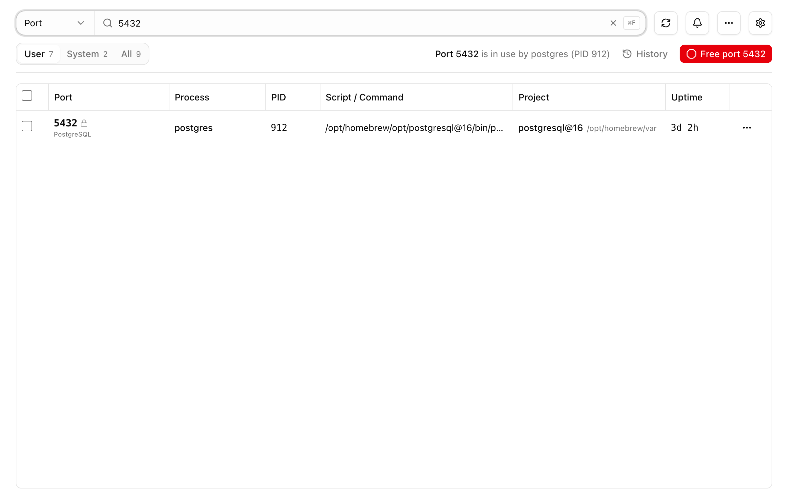
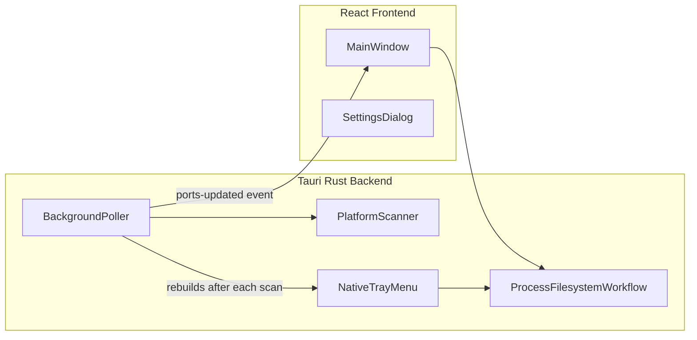

# Port Watch

<p align="left">
  
</p>

Cross-platform desktop port monitor built with **Tauri 2**, **React**, and **shadcn/ui**. Scan listening TCP/UDP ports, classify processes, and manage dev servers from the system tray or full window.


## Screenshots

| Main window (dark) | Main window (light) |
| --- | --- |
|  |  |

| Row actions | Settings |
| --- | --- |
|  |  |

| Port lookup |
| --- |
|  |

## Features

- **Live port scan** with configurable auto-refresh (3s / 10s / off), optional UDP
- **Process classification** — vendor/system/user listeners (Apple, Microsoft, distro packages), with filters to hide system services
- **Port lookup** — search by port, PID, process name, path, or command; history timeline and one-click **Free port**
- **Row actions** — stop process, open in browser, file manager, terminal, editor (Cursor / VS Code), copy path/URL, pin project, move to trash, delete permanently
- **Native tray menu** — every listening dev server with open, copy URL, reveal, terminal, editor and stop, without opening the window
- **Watched-port notifications** — in-app toasts and desktop alerts when specific ports change
- **Notification controls** — clear all toasts, mute port change toasts for 15 minutes / 1 hour / 8 hours, or turn them off, from the toast stack or the toolbar bell (mute and on/off are also in Settings)
- **Refresh state** — the toolbar says whether the list is live, paused while a menu or dialog is open, or off and how long ago it was updated
- **Export snapshot** — copy filtered results as JSON or Markdown
- **CLI** — `port-watch check <port> [--udp]` for scripting and CI
- **Safety guards** — blocks destructive actions on protected system paths

## Platform support

| Platform | Scanner backend | CLI PATH install |
| --- | --- | --- |
| macOS | `lsof` for sockets; `libproc` for process details, `ps` where that is refused | `/usr/local/bin/port-watch` (symlink; asks for an administrator password) |
| Linux | `ss` + `/proc` | `~/.local/bin/port-watch` (symlink; ensure `~/.local/bin` is on PATH) |
| Windows | PowerShell (`Get-NetTCPConnection`) | `%LOCALAPPDATA%\Programs\Port Watch\port-watch.cmd` (shim; user PATH) |

macOS-only UI: **menu bar mode** (accessory app / dockless tray).

## Requirements

- [Node.js](https://nodejs.org/) (npm or [bun](https://bun.sh/))
- [Rust toolchain](https://www.rust-lang.org/tools/install) (for Tauri)
- Platform build dependencies — see [Tauri prerequisites](https://v2.tauri.app/start/prerequisites/)

**Linux (Debian/Ubuntu)** additionally needs:

```bash
sudo apt install libwebkit2gtk-4.1-dev libayatana-appindicator3-dev librsvg2-dev patchelf
```

## Install from source

```bash
git clone https://github.com/SaiBarathR/port-watch.git
cd port-watch
npm install
npm run tauri dev
```

## Build

```bash
npm run tauri build
```

Release bundles are written to `src-tauri/target/release/bundle/` (`.app` on macOS, `.deb`/AppImage on Linux, `.msi`/`.exe` on Windows).

## Tests

```bash
npm test                  # the window: its logic, and the whole app against a stand-in backend
npm run test:coverage     # the same, with a table of what the tests reach
cd src-tauri && cargo test
node e2e/smoke.mjs <built app>   # Linux: the built app in its webview, see the file
```

The Rust tests start real processes and run the system's own tools (`lsof`, `ss`, PowerShell), so each platform's code is only tested on that platform. CI runs all three, and writes a coverage table to each run's summary without enforcing a number. On Linux it also starts the built app in its real webview, finds a listener in the table and stops it from its row; on Windows it checks that the built app starts and stays up.

## Releases

Pre-built installers are published on [GitHub Releases](https://github.com/SaiBarathR/port-watch/releases):

| Platform | Download |
| --- | --- |
| macOS | `.dmg` (universal: Apple Silicon + Intel) |
| Windows | `.msi` or `.exe` setup |
| Linux | `.deb`, `.rpm`, or `.AppImage` |

Builds are unsigned. macOS may show Gatekeeper warnings (right-click → Open, or allow in System Settings → Privacy & Security). Windows SmartScreen may prompt for “More info” → “Run anyway”.

### Publishing a new release

1. Bump `version` in `package.json`, `src-tauri/Cargo.toml`, and `src-tauri/tauri.conf.json` (keep them in sync).
2. Commit and push to `main`.
3. Tag and push:
   ```bash
   git tag v0.1.0
   git push origin v0.1.0
   ```
4. GitHub Actions builds on macOS, Linux, and Windows and uploads assets to a draft release. Review and publish it on the Releases page.

## Usage

### Main window

The full window lists every listening port, largest first in each row: the port, then who can reach it (every network interface, one address, or this machine only), the process, and its project folder. Use the toolbar to search, to switch between your own listeners, the system's, or all of them, to export what is shown, and to open settings.

Right-click a row, or use its **…** button, for everything that can be done with it: open it in the browser, open its project in the editor or a terminal, pin or watch it, stop it, or move its folder to the Trash. Hold **⌥** (**Shift** on Windows and Linux) while the menu is open to delete the folder permanently instead.

### Keyboard

The table is one tab stop: Tab onto a row, then use the arrow keys.

| Keys (macOS) | Windows / Linux | Does |
| --- | --- | --- |
| ⌘F or / | Ctrl+F or / | Search |
| ↓ from the search box | ↓ | Into the rows |
| ↑ ↓ Home End | same | Move between rows |
| Space | Space | Select the row |
| ↵ | Enter | Open in the browser |
| ⌘O | Ctrl+O | Open the project in the editor |
| ⇧⌘C | Ctrl+Shift+C | Copy the URL |
| ⌘⌫ | Ctrl+Backspace | Stop (asks first) |
| ⌘K | Ctrl+K | The row's menu |
| ⌘R | Ctrl+R | Refresh |
| ⌘, | Ctrl+, | Settings |

### Tray menu

Click the tray icon for a native menu of your listening dev servers. Each one has a submenu to open it in the browser, copy its URL, show its folder, open a terminal or editor there, or stop it (after a confirmation). On macOS, enable **Menu bar mode** from the same menu to hide the Dock icon.

### Port lookup

Search by port and type a port number to see, on the line under the search box, whether it is free and who last held it, or who is using it now. **History** shows what has come and gone on it; **Free port** stops every process bound to it that can be stopped. The history of every port is under **… → Port History**.

### CLI

Install from **Settings → Integrations → Command-line tool** (one click), from the strip the app shows under the table until it is installed or dismissed, or by running `install-cli` on the bundled binary:

```bash
port-watch check 3000
port-watch check 53 --udp
```

**Exit codes:** `0` = port free, `1` = port in use (JSON on stdout), `2` = error.

What the install puts on your PATH:

- **macOS:** a symlink at `/usr/local/bin/port-watch`. That folder belongs to root on a stock Mac, so installing and uninstalling ask for an administrator password.
- **Linux:** a symlink at `~/.local/bin/port-watch`.
- **Windows:** a `port-watch.cmd` shim under `%LOCALAPPDATA%\Programs\Port Watch`, added to your user PATH. The app itself is a windowed program that a shell does not wait for; the shim makes `port-watch check` print before the prompt returns and hand back its exit code in both cmd and PowerShell.

**Direct binary examples:**

```bash
# macOS
"/Applications/Port Watch.app/Contents/MacOS/port-watch" check 3000

# Linux / Windows (path varies by install location)
port-watch install-cli
```

## How it works


```mermaid
flowchart LR
  subgraph frontend [React Frontend]
    MainWindow[MainWindow]
    Settings[SettingsDialog]
  end
  subgraph backend [Tauri Rust Backend]
    Poller[BackgroundPoller]
    Scanner[PlatformScanner]
    Tray[NativeTrayMenu]
    Commands[ProcessFilesystemWorkflow]
  end
  Poller --> Scanner
  Poller -->|ports-updated event| MainWindow
  Poller -->|rebuilds after each scan| Tray
  MainWindow --> Commands
  Tray --> Commands
```

## Safety

Deleting a project folder (move to trash, delete permanently) is one backend step that checks the folder before it stops the process. A folder can be deleted only if all of these hold:

- It is the project folder the latest scan recorded for that process. The window cannot name any other path.
- It is a real folder (not a symlink or a file) inside your home folder.
- It is not your home folder itself, one of its standard folders (`Desktop`, `Documents`, `Downloads`, …), a synced folder (`Dropbox`, `OneDrive`, `Google Drive`, `iCloudDrive`), or anywhere inside app data and settings (`Library`, `Applications`, `AppData`, and hidden folders such as `.config` or `.ssh`). Projects inside a standard or synced folder can be deleted; the folder itself cannot.
- It was not merely guessed from where the program is installed.
- It is not under a protected system path:
  - **macOS:** `/System`, `/usr`, `/bin`, `/sbin`, `/Library`
  - **Linux:** `/usr`, `/bin`, `/sbin`, `/lib`, `/lib64`, `/opt` (not `/usr/local`)
  - **Windows:** `C:\Windows`, `Program Files`, `Program Files (x86)`, `ProgramData`

On Windows the folder is inferred rather than read from the process, so delete is offered only when it comes from a script path.

Stop refuses a PID that is not in the latest scan, or whose name or start time no longer match what the scan saw: the PID has passed to another process. System process stop/delete requires an explicit opt-in in Settings, and "Stop all user processes shown" never includes system services.

## Tech stack

Tauri 2 · Rust · React 19 · shadcn/ui · Tailwind 4 · TanStack Table

## License

MIT — see [LICENSE](LICENSE).
